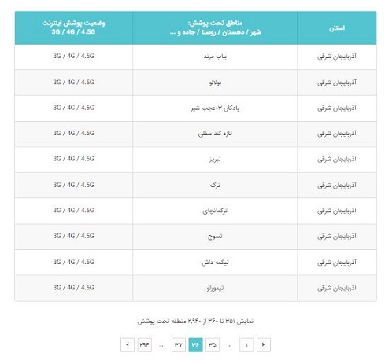

# MCI Internet Coverage Status Web Scraper

This Python script uses Selenium to scrape data from the MCI (Mobile Telecommunication Company of Iran) website to collect information about the internet coverage status for various regions in Iran. The data is then saved to an Excel file for further analysis.

<div align="center">
  
</div>

## Getting Started

These instructions will help you set up and run the web scraping script on your local machine. You can use different web browsers, not limited to Chrome, depending on your preference.

### Prerequisites

- **Python**: Make sure you have Python installed on your system. You can download it from the [Python official website](https://www.python.org/downloads/).

- **Required Python packages**: You can install the necessary Python packages using pip:

    ```bash
    pip install -r requirements.txt
    ```

### Usage

1. Clone the repository to your local machine.

   ```bash
   git clone https://github.com/amasoudfam/MCI-Internet-Coverage.git
   ```

2. Move into the project directory.

   ```bash
   cd MCI-Internet-Coverage
   ```

3. Run the Python script.

   ```bash
   python MCI_internet_coverage.py
   ```

4. The script will scrape the data and save it in an Excel file named `MCI_internet_coverage.xlsx` in the same directory.


**Please Note:** There is no need to add executable webdriver file in the code directory in selenium `v4.6.0` or above. [Selenium Manager](https://www.selenium.dev/blog/2022/introducing-selenium-manager/) will download the webdriver automatically.
For the lower selenium versions, the WebDriver file (e.g., `chromedriver` for Chrome) must be placed in the same directory as the Python script (`MCI_internet_coverage.py`) for the script to work correctly. You can download the webdriver via links below. Make sure the WebDriver version matches your web browser. 

    - [Chrome WebDriver Downloads](https://sites.google.com/a/chromium.org/chromedriver/downloads) (for Chrome)
    - [GeckoDriver for Firefox](https://github.com/mozilla/geckodriver/releases) (for Firefox)
    - [WebDriver for Other Browsers](https://www.selenium.dev/documentation/en/webdriver/driver_requirements/) (for other browsers)


## Data Format

The scraped data is saved in an Excel file with the following columns:

- Province
- Region
- Status (Internet Coverage Status)
- 3G (1 if 3G is available, 0 otherwise)
- 4G (1 if 4G is available, 0 otherwise)
- 4.5G (1 if 4.5G is available, 0 otherwise)

## License

This project is licensed under the MIT License - see the [LICENSE](LICENSE) file for details.

## Acknowledgments

- This project is not affiliated with or endorsed by MCI (Mobile Telecommunication Company of Iran).

## Learn More About Web Scraping and Selenium

- [Web Scraping Wikipedia](https://en.wikipedia.org/wiki/Web_scraping)
- [Web Scraping Using Python](https://realpython.com/tutorials/web-scraping/)
- [Selenium Official Documentation](https://www.selenium.dev/documentation/en/)
- [Selenium Python Tutorial](https://www.selenium.dev/documentation/en/getting_started/quick)
- [Selenium with Python - Tutorialspoint](https://www.tutorialspoint.com/selenium/index.htm)
- [Web Scraping with Selenium and Python](https://realpython.com/modern-web-automation-with-python-and-selenium/)

### Using Browsers Other Than Chrome

You can use web browsers other than Chrome with Selenium. To learn more about setting up Selenium with different browsers, refer to the official documentation:

- [Selenium Web Browsers](https://www.selenium.dev/documentation/en/webdriver/driver_requirements/)


## Important Note (Last Updated: October 23, 2023)

This web scraping script is designed to work with the current design and structure of the MCI website as of October 23, 2023. Websites may undergo updates or changes in design over time, which can impact the script's functionality. If you encounter issues with the script, especially after changes to the MCI website, you may need to adapt the script to match the new structure.


